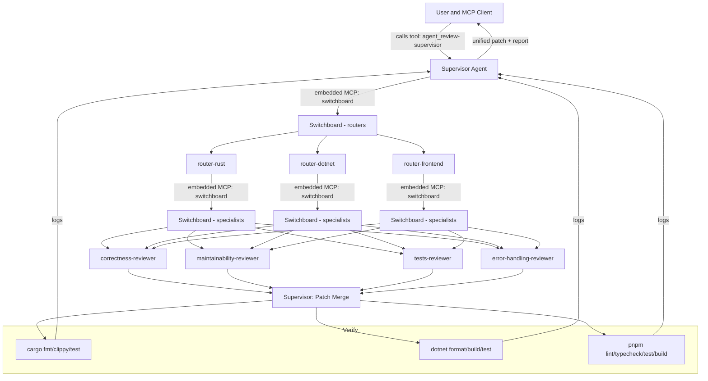
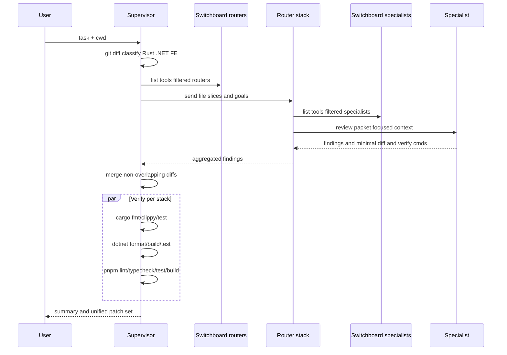

# Hierarchical Agents — Supervisor → Routers → Specialists

This example shows how a single user call routes through a hierarchy:
- Supervisor coordinates the review, merges diffs, and runs verification.
- Routers classify changes by stack (Rust/.NET/Frontend) and fan out to specialists.
- Specialists propose minimal diffs and tests for specific concerns (correctness, maintainability, tests, error-handling).

Switchboard MCP exposes child agents as plain MCP tools to parents. Each parent embeds a Switchboard server configured via environment to only discover its children.

## Architecture (Flow)



## Sequence (Routing & Verification)



## Wiring via Switchboard MCP

- Supervisor (parent) embeds Switchboard to expose routers only:

```toml
[mcp_servers.switchboard]
command = "switchboard-mcp"
args = []
env = {
  AGENTS_DIRS = "examples/hierarchical-agents/routers",
  AGENTS_FILTER = "router-rust router-dotnet router-frontend"
}
```

- Routers embed Switchboard to expose specialists only:

```toml
[mcp_servers.switchboard]
command = "switchboard-mcp"
args = []
env = {
  AGENTS_DIRS = "examples/hierarchical-agents/specialists",
  AGENTS_FILTER = "correctness-reviewer maintainability-reviewer tests-reviewer error-handling-reviewer"
}
```

Notes
- Parents call children as MCP tools. No extra tools beyond terminal + apply_patch.
- Embedded servers must be stdio — see project README for HTTP/SSE proxying if needed.
- Adjust AGENTS_DIRS/AGENTS_FILTER to include/exclude child agents by path/name/tag.

## Files
- supervisor: examples/hierarchical-agents/supervisor/review-supervisor.toml
- routers: examples/hierarchical-agents/routers/router-{rust,dotnet,frontend}.toml
- specialists: examples/hierarchical-agents/specialists/specialist-*.toml

## Quick Verify with MCP Inspector (npx)

- List routers as tools exposed by Switchboard:

```sh
AGENTS_DIRS="examples/hierarchical-agents/routers" \
AGENTS_FILTER="router-rust router-dotnet router-frontend" \
npx -y @modelcontextprotocol/inspector --cli switchboard-mcp --method tools/list
```

- List specialists as tools exposed by Switchboard:

```sh
AGENTS_DIRS="examples/hierarchical-agents/specialists" \
AGENTS_FILTER="correctness-reviewer maintainability-reviewer tests-reviewer error-handling-reviewer" \
npx -y @modelcontextprotocol/inspector --cli switchboard-mcp --method tools/list
```

- List the supervisor agent tool (so you can call it):

```sh
AGENTS_DIRS="examples/hierarchical-agents/supervisor" \
npx -y @modelcontextprotocol/inspector --cli switchboard-mcp --method tools/list
```

- Call the supervisor agent (dry run example):

```sh
AGENTS_DIRS="examples/hierarchical-agents/supervisor" \
npx -y @modelcontextprotocol/inspector --cli switchboard-mcp \
  --method tools/call \
  --tool-name agent_review-supervisor \
  --tool-arg task='Review the latest diff and plan routing (dry run)' \
  --tool-arg cwd="$PWD"
```
